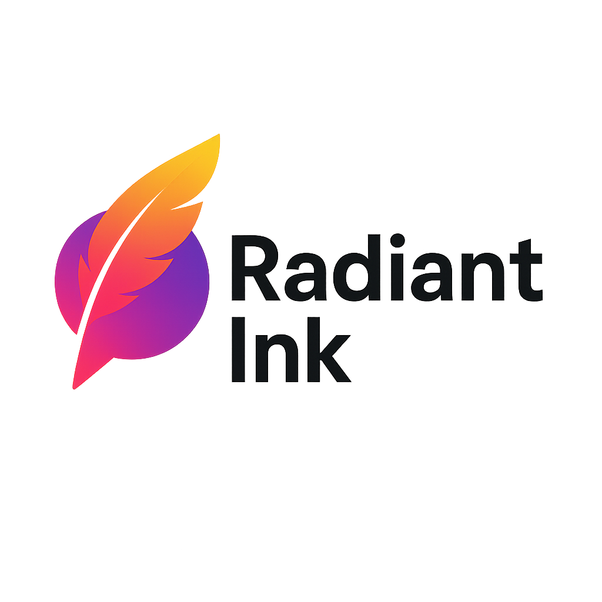
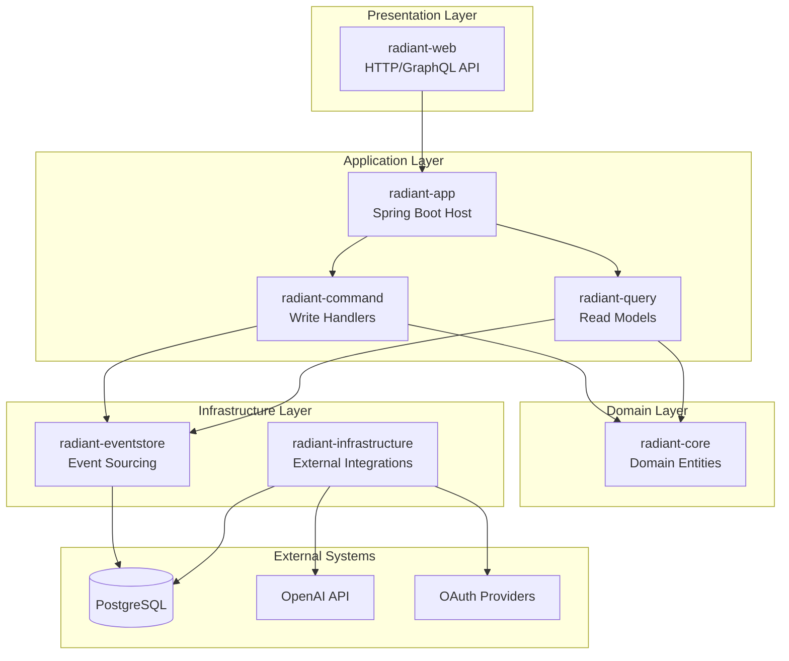

<div align="center">
  
</div>

## 서비스 소개

Radiant Ink는 다국어로 작성된 다양한 분야의 글을 한글로 번역하고, 사용자가 직접 참여하여 번역에 기여할 수 있는 플랫폼입니다. 

### 주요 기능

- **다국어 번역**: 다양한 언어로 작성된 글을 정확하고 자연스러운 한글로 번역
- **사용자 참여**: 모든 사용자가 번역에 직접 기여하고 개선할 수 있는 협업 플랫폼
- **다양한 분야**: 기술, 과학, 문화, 예술 등 다양한 분야의 콘텐츠 제공
- **인사이트 공유**: 번역된 글을 통해 새로운 지식과 인사이트를 얻을 수 있는 학습 환경
- **커뮤니티 토론**: 사용자들과 함께 번역된 내용에 대해 토론하고 의견을 나눌 수 있는 공간

### 기술 스택

- **Backend**: Spring Boot, Kotlin
- **Architecture**: CQRS, Event Sourcing
- **Database**: PostgreSQL
- **API**: GraphQL

### 시작하기

```bash
# 프로젝트 빌드
./gradlew clean build

# 애플리케이션 실행
./gradlew :radiant-app:bootRun
```

### 아키텍처 다이어그램



---

**Radiant Ink**와 함께 언어의 장벽을 넘어 전 세계의 지식과 인사이트를 공유해보세요.
